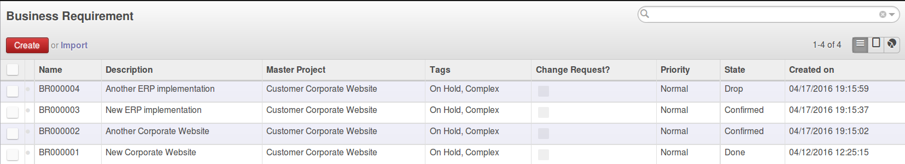
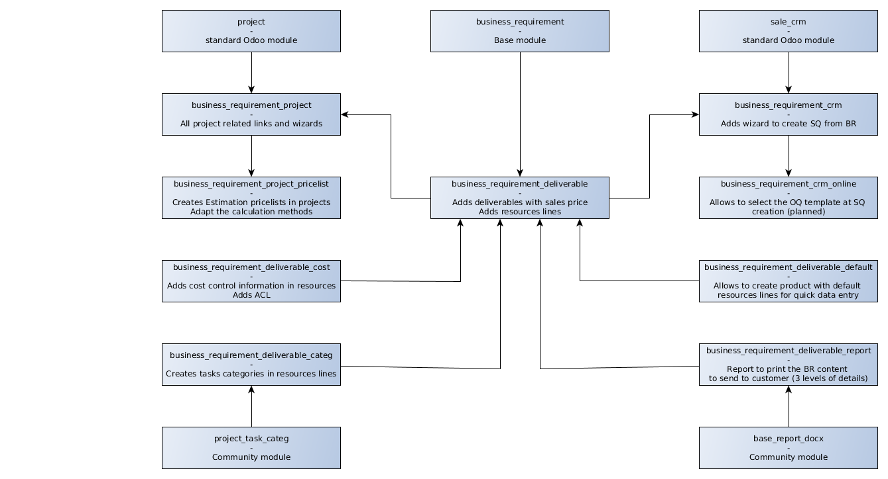
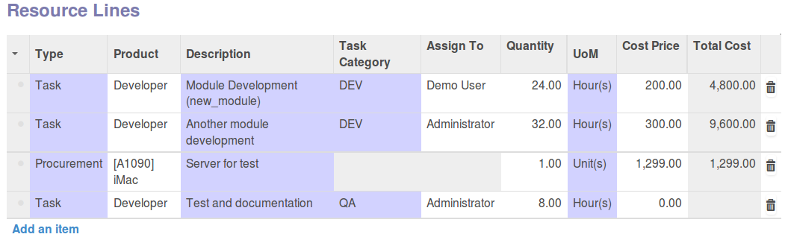

.. image:: https://img.shields.io/badge/licence-AGPL--3-blue.svg
   :target: http://www.gnu.org/licenses/agpl-3.0-standalone.html
   :alt: License: AGPL-3

==============================================
Business Requirement Deliverable Task Category
==============================================

Introduction
^^^^^^^^^^^^

This module is part of a set ("Business Requirement") and provides the basic 
models for business requirement management and project time/cost estimation.

|image7|

The set comprises of multiple modules that can be used independently or not:

=========================================== ====================================
Module                                      Description
=========================================== ====================================
business_requirement                        Basic models and functions
business_requirement_project                Wizard to create project/tasks 
                                            from BR/resource lines
business_requirement_crm                    Wizard to create/update Sales 
                                            Quotation based on deliverables
business_requirement_deliverable            Adds deliverables and resources lines
business_requirement_deliverable_report     Adds printout to send BR and 
                                            deliverables to the customer
business_requirement_deliverable_default    Adds default resource lines for 
                                            deliverable products
business_requirement_deliverable_cost       Add sales and cost price for 
                                            estimation and profit control
business_requirement_deliverable_categ      Adds the possibility to have 
                                            tasks category in resources
=========================================== ====================================

Many other modules (business_requirement_*) completes this basic list.

The following diagram gives a simplified view of the universe:

|image11|

What is a Business Requirement?
^^^^^^^^^^^^^^^^^^^^^^^^^^^^^^^

A Business requirement (BR) is the expression of a business need by a customer 
or internal project user. 
A BR can contain multiple different parts depending on the company needs:

* Customer Story: this is the requirement as expressed by the customer
* Scenario: How/where the current solution can provide a suitable scenario to 
  answer the customer story
* Gap: For the uncovered part of the scenario, elaborate the gap/need for specific 
  developments/setup
* Deliverables to be provided to the customer/user
* Resources necessary to achieve the deliverables
* Additional information (approval, cost control etc.)

These modules were originally designed for the service/IT industry but the 
requirement management is generic and can apply to many cases/industries (customer 
or internal projects):

* Construction
* Trading (New product development)
* Business Consultancy
* IT development

What is the difference between a BR and CRM lead?

* CRM leads are sales oriented
* BR are project and workload estimation oriented

How to use this module?
^^^^^^^^^^^^^^^^^^^^^^^

This module introduces 1 new concept in the business requirements resource line:

* Task Category
* If module business_requirement_project is installed the category will be 
  propagated to the task at project/task creation.

Installation
============

No specific steps required

Configuration
=============

Users
^^^^^

No specific ACL are required for the module.

Task category
^^^^^^^^^^^^^

You can define the task category in the Project/Configuration/Task category menu

Usage
=====

#. In the BR, you can add as many deliverable lines as necessary. Price of the deliverable lines will depend on the pricelist in master project or customer.

#. Once the deliverable lines are created you can create as many resources lines as necessary in each DL. 

#. in RL you can already assign task category on top of the assignee if necessary

|image2|

.. image:: https://odoo-community.org/website/image/ir.attachment/5784_f2813bd/datas
   :alt: Try me on Runbot
   :target: https://runbot.odoo-community.org/runbot/140/8.0

Bug Tracker
===========

Bugs are tracked on `GitHub Issues
<https://github.com/OCA/project/issues>`_. In case of trouble, please
check there if your issue has already been reported. If you spotted it first,
help us smashing it by providing a detailed and welcomed `feedback
<https://github.com/OCA/
project/issues/new?body=module:%20
business_requirement_deliverable_categ%0Aversion:%20
8.0%0A%0A**Steps%20to%20reproduce**%0A-%20...%0A%0A**Current%20behavior**%0A%0A**Expected%20behavior**>`_.

Credits
=======

Images
------

* Odoo Community Association: `Icon <https://github.com/OCA/maintainer-tools/blob/master/template/module/static/description/icon.svg>`_.

Contributors
------------

* Eric Caudal <eric.caudal@elico-corp.com>
* Victor M. Martin <victor.martin@elico-corp.com>

Maintainer
----------

.. image:: https://odoo-community.org/logo.png
   :alt: Odoo Community Association
   :target: https://odoo-community.org

This module is maintained by the OCA.

OCA, or the Odoo Community Association, is a nonprofit organization whose
mission is to support the collaborative development of Odoo features and
promote its widespread use.

To contribute to this module, please visit https://odoo-community.org.
