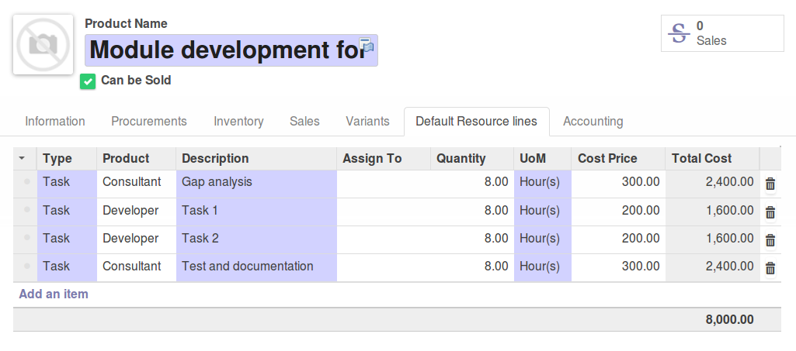
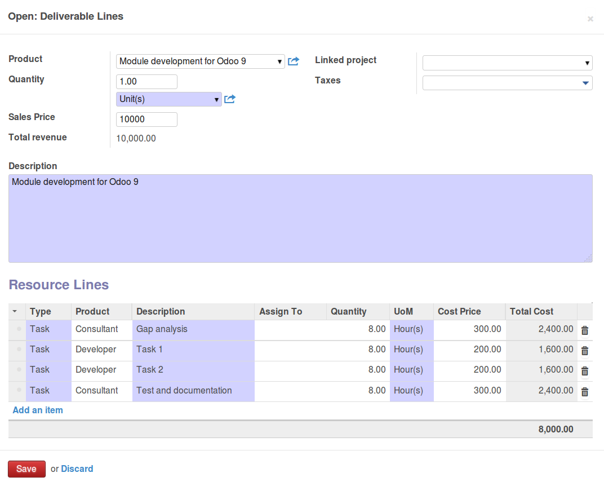

.. image:: https://img.shields.io/badge/licence-AGPL--3-blue.svg
   :target: https://www.gnu.org/licenses/agpl-3.0-standalone.html
   :alt: License: AGPL-3

========================================
Business Requirement Deliverable Default
========================================

Introduction
^^^^^^^^^^^^

This module is part of a set ("Business Requirement") and provides the basic 
models for business requirement management and project time/cost estimation.

|image7|

.. |image7| image:: static/img/bus_req_tree.png
   :width: 800 px
   :alt: Business Requirement List view 

The set comprises of multiple modules that can be used independently or not:

=========================================== ====================================
Module                                      Description
=========================================== ====================================
business_requirement                        Basic models and functions
business_requirement_project                Wizard to create project/tasks 
                                            from BR/resource lines
business_requirement_crm                    Wizard to create/update Sales 
                                            Quotation based on deliverables
business_requirement_deliverable            Adds deliverables and resources lines
business_requirement_deliverable_report     Adds printout to send BR and 
                                            deliverables to the customer
business_requirement_deliverable_default    Adds default resource lines for 
                                            deliverable products
business_requirement_deliverable_cost       Add sales and cost price for 
                                            estimation and profit control
business_requirement_deliverable_categ      Adds the possibility to have 
                                            tasks category in resources
=========================================== ====================================

Many other modules (business_requirement_*) completes this basic list.

What is a Business Requirement?
^^^^^^^^^^^^^^^^^^^^^^^^^^^^^^^

A Business requirement (BR) is the expression of a business need by a customer 
or internal project user. 
A BR can contain multiple different parts depending on the company needs:

* Customer Story: this is the requirement as expressed by the customer
* Scenario: How/where the current solution can provide a suitable scenario to 
  answer the customer story
* Gap: For the uncovered part of the scenario, elaborate the gap/need for specific 
  developments/setup
* Deliverables to be provided to the customer/user
* Resources necessary to achieve the deliverables
* Additional information (approval, cost control etc.)

These modules were originally designed for the service/IT industry but the 
requirement management is generic and can apply to many cases/industries (customer 
or internal projects):

* Construction
* Trading (New product development)
* Business Consultancy
* IT development

What is the difference between a BR and CRM lead?

* CRM leads are sales oriented
* BR are project and workload estimation oriented

How to use this module?
^^^^^^^^^^^^^^^^^^^^^^^

This module adds the following features to the deliverable modules:

* Possibility to create default resource lines for a given product. This allows
  the user to have standard resource lines uploaded in the BR for deliverable 
  packages.

Installation
============

No specific steps required

Configuration
=============

Users
^^^^^

No special ACL set up

Default resources in Deliverable Product
^^^^^^^^^^^^^^^^^^^^^^^^^^^^^^^^^^^^^^^^

You can create Deliverable products and add in them standard resource lines
expected to be added in the Business requirement by default.
Depending on the modules you are using for the business requirements, the 
content of the resources lines will reflect the expected resources lines in the 
BR.

|image2|

Usage
=====

#. Prepare your deliverables in the Product menu and add the expected RL

#. Create a new BR and add the deliverable product in the deliverable line

#. Adapt the resources lines if necessary

|image3|

.. image:: https://odoo-community.org/website/image/ir.attachment/5784_f2813bd/datas
   :alt: Try me on Runbot
   :target: https://runbot.odoo-community.org/runbot/140/8.0

On product_template view add a new tab "Resources" with the resource lines management (You could add, delete or create new resources).

Known issues / Roadmap
======================

* Currently prices are not updated when the resource lines are uploaded in the 
  BR. => Add a button to recalculate Sales estimation prices in the Deliverable 
  line

Bug Tracker
===========

Bugs are tracked on `GitHub Issues <https://github.com/OCA/
project/issues>`_.
In case of trouble, please check there if your issue has already been reported.
If you spotted it first, help us smashing it by providing a detailed and welcomed feedback `here <https://github.com/OCA/
project/issues/new?body=module:%20
business_requirement_deliverable_default%0Aversion:%20
8.0%0A%0A**Steps%20to%20reproduce**%0A-%20...%0A%0A**Current%20behavior**%0A%0A**Expected%20behavior**>`_.

Credits
=======

Contributors
------------

* Victor M. Martin <victor.martin@elico-corp.com>

Maintainer
----------

.. image:: https://odoo-community.org/logo.png
   :alt: Odoo Community Association
   :target: https://odoo-community.org

This module is maintained by the OCA.

OCA, or the Odoo Community Association, is a nonprofit organization whose
mission is to support the collaborative development of Odoo features and
promote its widespread use.

To contribute to this module, please visit https://odoo-community.org.
