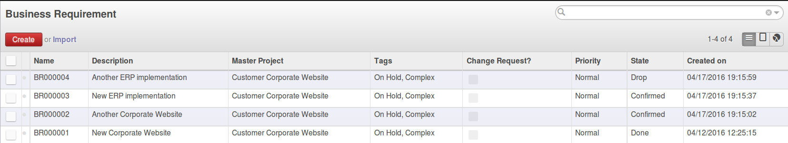
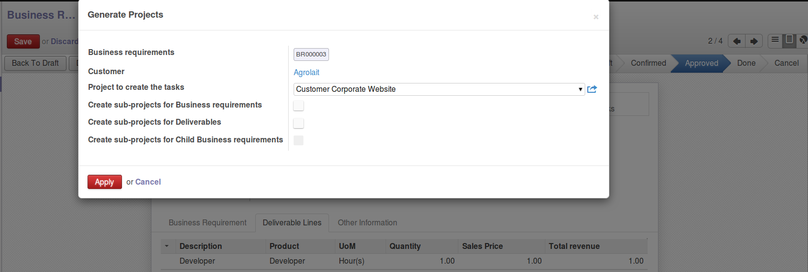

.. image:: https://img.shields.io/badge/licence-AGPL--3-blue.svg
   :target: https://www.gnu.org/licenses/agpl-3.0-standalone.html
   :alt: License: AGPL-3

==============================
Business Requirement - Project
==============================

Introduction
^^^^^^^^^^^^

This module is part of a set ("Business Requirement") and provides the basic 
models for business requirement management and project time/cost estimation.

|image7|

The set comprises of multiple modules that can be used independently or not:

=========================================== ====================================
Module                                      Description
=========================================== ====================================
business_requirement                        Basic models and functions
business_requirement_project                Wizard to create project/tasks 
                                            from BR/resource lines
business_requirement_crm                    Wizard to create/update Sales 
                                            Quotation based on deliverables
business_requirement_deliverable            Adds deliverables and resources lines
business_requirement_deliverable_report     Adds printout to send BR and 
                                            deliverables to the customer
business_requirement_deliverable_default    Adds default resource lines for 
                                            deliverable products
business_requirement_deliverable_cost       Add sales and cost price for 
                                            estimation and profit control
business_requirement_deliverable_categ      Adds the possibility to have 
                                            tasks category in resources
=========================================== ====================================

Many other modules (business_requirement_*) complete this basic list.

What is a Business Requirement?
^^^^^^^^^^^^^^^^^^^^^^^^^^^^^^^

A Business requirement (BR) is the expression of a business need by a customer 
or internal project user. 
A BR can contain multiple different parts depending on the company needs:

* Customer Story: this is the requirement as expressed by the customer
* Scenario: How/where the current solution can provide a suitable scenario to 
  answer the customer story
* Gap: For the uncovered part of the scenario, elaborate the gap/need for specific 
  developments/setup
* Deliverables to be provided to the customer/user
* Resources necessary to achieve the deliverables
* Additional information (approval, cost control etc.)

These modules were originally design for the service/IT industry but the 
requirement management is generic and can apply to many cases/industries (customer 
or internal projects):

* Construction
* Trading (New product development)
* Business Consultancy
* IT development

What is the difference between a BR and CRM lead?

* CRM leads are sales oriented
* BR are project and workload estimation oriented

How to use this module?
^^^^^^^^^^^^^^^^^^^^^^^

This module contains 2 main wizards to create projects/tasks:

* Generate Project in the master project view
* Generate Project in the Business requirement view

This module depends on:

* **business_requirement**: definition of business requirements
* **business_requirement_deliverable**: definition of deliverable and resources 
  lines, necessary to create the project information

Based on the information from business requirement and the resource lines the 
wizard will create:

* Projects and sub project based on BR and deliverable (optional)
* Tasks based on the resources lines set as tasks

|image0|

Installation
============

No specific steps required

Configuration
=============

Users
^^^^^

Only Project Manager can have access to the wizard button.

Master project
^^^^^^^^^^^^^^

You can define a master project linked to the business requirement.

The master project will be the parent of any project created via the wizard.

Usage
=====

Procedure
^^^^^^^^^

#. Create multiple BR linked to one or several master projects
#. fill in the deliverables lines and corresponding resources lines (RL)
#. Properly define your RL description, time and assignee (used for task creation)
#. Confirm and Approve the Business Requirements
#. At that stage you can either

  #. Create the project in each business requirement via corresponding button
  #. Go to the master project and create the projects for all BR related to 
     the master project 

#. The wizard is triggered and you can select the following option regarding the
   hierarchy of projects
   
  #. Parent project for creation
  #. Create sub-projects for Business requirements
  #. Create sub-projects for Deliverables
  #. Create sub-projects for Child Business requirements 

Example
^^^^^^^

eg: if a master project contains the following BR:
* BR1 with Deliverable Line 1 (DL) containing 2 Resource Lines (RL): RL1 and RL2
* BR2 with DL2 and DL3 containing each 2 RL: RL3 and RL4, RL5 and RL6
* BR3 with DL4 and one RL: RL7 (Sub BR of BR2)

If no option is selected: 

* No sub project created
* 7 tasks are created in the master project (for RL1~RL7)

If option 1 is selected: 

* 3 sub projects (parent is Master project), one per BR 
* 7 tasks are created for 
  * BR1 (2 tasks for RL1 and RL2), 
  * BR2 (4 tasks for RL3~6), 
  * BR3 (1 task for RL7)
  
If option 2 is selected: 

* 4 sub projects (parent is Master project), one per DL
* 7 tasks are created for
  * DL1 (2 tasks for RL1 and RL2),
  * DL2 (2 tasks for RL3~4),
  * DL3 (2 tasks for RL5~6) and 
  * DL4 (1 task for RL7)

If option 1+2 are selected: 

* 7 sub projects (parent is Master project), one per BR and one per DL
* BR1 sub-project contains DL1 sub-project, 
* BR2 sub-project contains DL2 and DL3 sub-projects, 
* BR3 sub-project contains DL4 sub-project 
* 7 tasks are created for 
  * DL1 (2 tasks for RL1 and RL2), 
  * DL2 (2 tasks for RL3~4), 
  * DL3 (2 tasks for RL5~6) and 
  * DL4 (1 task for RL7)

If option 1+3 are selected: 

* 7 sub projects (parent is Master project), one per BR and one per DL
* BR1 sub-project 
* BR2 sub-project contains BR3 sub-projects, 
* 7 tasks are created for 
  * BR1 (2 tasks for RL1 and RL2), 
  * BR2 (4 tasks for RL3~6), 
  * BR3 (1 task for RL7)

If option 1+2+3 are selected: 
* BR1 sub-project contains DL1 sub-project, 
* BR2 sub-project contains BR2, DL2 and DL3 sub-projects, 
* BR3 sub-project contains DL4 sub-project 
* 7 tasks are created for 
  * DL1 (2 tasks for RL1 and RL2),
  * DL2 (2 tasks for RL3~4),
  * DL3 (2 tasks for RL5~6) and 
  * DL4 (1 task for RL7)

.. image:: https://odoo-community.org/website/image/ir.attachment/5784_f2813bd/datas
   :alt: Try me on Runbot
   :target: https://runbot.odoo-community.org/runbot/140/8.0

Bug Tracker
===========

Bugs are tracked on `GitHub Issues <https://github.com/OCA/
project/issues>`_.
In case of trouble, please check there if your issue has already been reported.
If you spotted it first, help us smashing it by providing a detailed and welcomed feedback `here <https://github.com/OCA/
project/issues/new?body=module:%20
business_requirement_project%0Aversion:%20
8.0%0A%0A**Steps%20to%20reproduce**%0A-%20...%0A%0A**Current%20behavior**%0A%0A**Expected%20behavior**>`_.

Credits
=======

Images
------

* Odoo Community Association: `Icon <https://github.com/OCA/maintainer-tools/blob/master/template/module/static/description/icon.svg>`_.

Contributors
------------

* Eric Caudal<eric.caudal@elico-corp.com>
* Alex Duan<alex.duan@elico-corp.com>
* Xie XiaoPeng<xie.xiaopeng@elico-corp.com>
* Victor M. Martin <victor.martin@elico-corp.com>

Maintainer
----------

.. image:: https://odoo-community.org/logo.png
   :alt: Odoo Community Association
   :target: https://odoo-community.org

This module is maintained by the OCA.

OCA, or the Odoo Community Association, is a nonprofit organization whose
mission is to support the collaborative development of Odoo features and
promote its widespread use.

To contribute to this module, please visit https://odoo-community.org.
