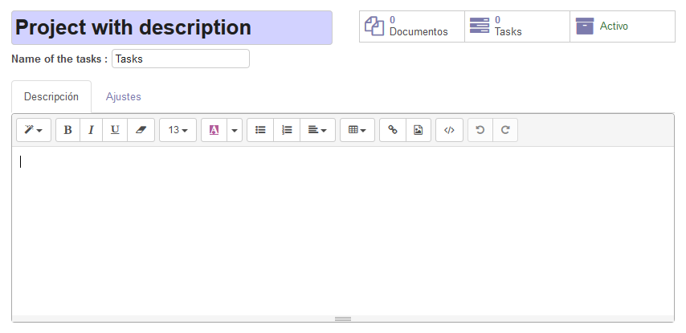

.. image:: https://img.shields.io/badge/licence-AGPL--3-blue.png
   :target: https://www.gnu.org/licenses/agpl
   :alt: License: AGPL-3

===================
Project Description
===================

This module extends the functionality of projects to support setting a
description for each project and allow you to search by that description.

Usage
=====

To set a description for a project, you need to:

#. Go to *Project > Project > Projects*.
#. Edit or create one.
#. You will see a new *Description* tab, with an HTML area to set the project's description.

To search for a project by its description, you need to:

#. Go to *Project > Project > Projects*.
#. Enter any word in the search box.
#. Select *Search Description*.

.. image:: https://odoo-community.org/website/image/ir.attachment/5784_f2813bd/datas
   :alt: Try me on Runbot
   :target: https://runbot.odoo-community.org/runbot/140/11.0

Bug Tracker
===========

Bugs are tracked on `GitHub Issues
<https://github.com/OCA/project/issues>`_. In case of trouble, please
check there if your issue has already been reported. If you spotted it first,
help us smash it by providing detailed and welcomed feedback.

Credits
=======

Contributors
------------

* Tecnativa (https://www.tecnativa.com): Rafael Blasco <rafael.blasco@tecnativa.com>
* Tecnativa (https://www.tecnativa.com): Jairo Llopis <jairo.llopis@tecnativa.com>
* C2i Change 2 improve (http://close2circle.com): Eduardo Magdalena <emagdalena@c2i.es>

Maintainer
----------

.. image:: https://odoo-community.org/logo.png
   :alt: Odoo Community Association
   :target: https://odoo-community.org

This module is maintained by the OCA.

OCA, or the Odoo Community Association, is a nonprofit organization whose
mission is to support the collaborative development of Odoo features and
promote its widespread use.

To contribute to this module, please visit https://odoo-community.org.
