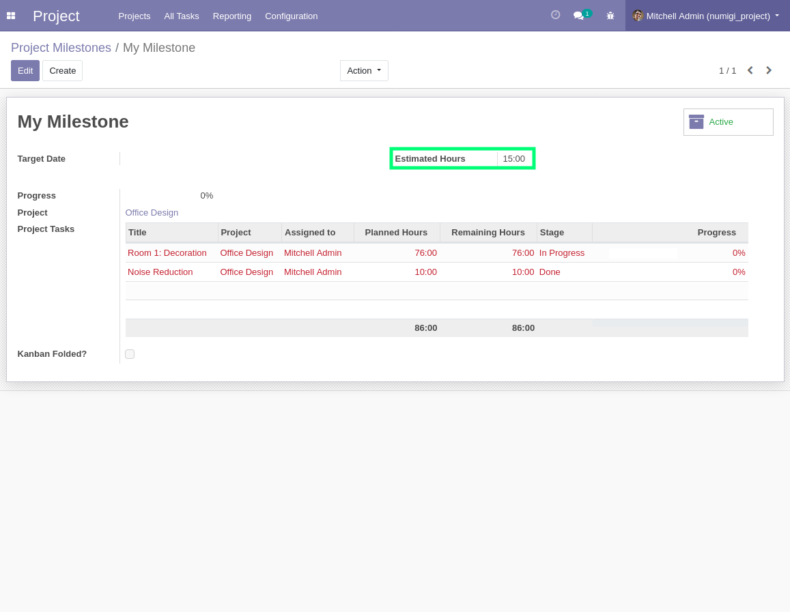
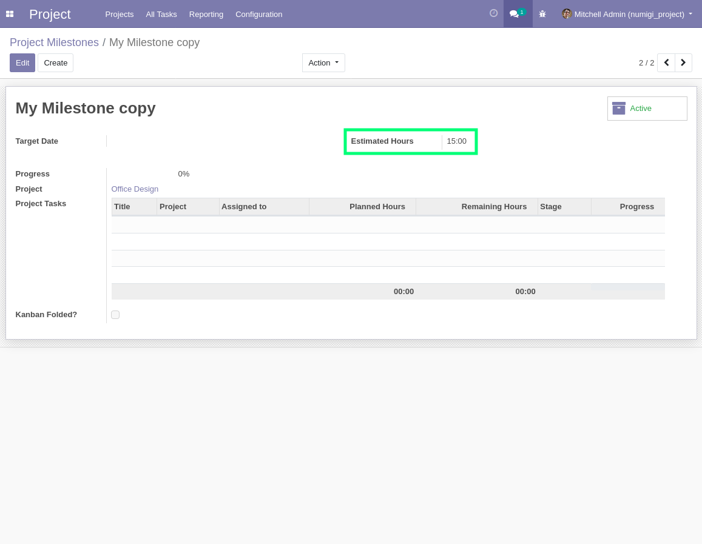
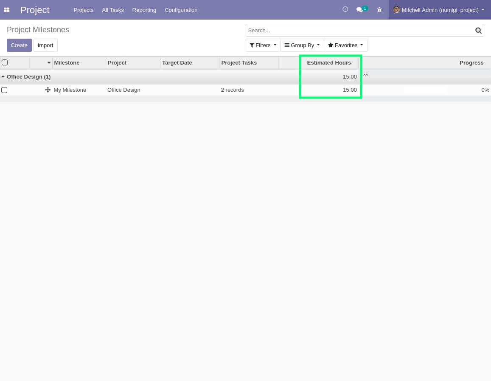
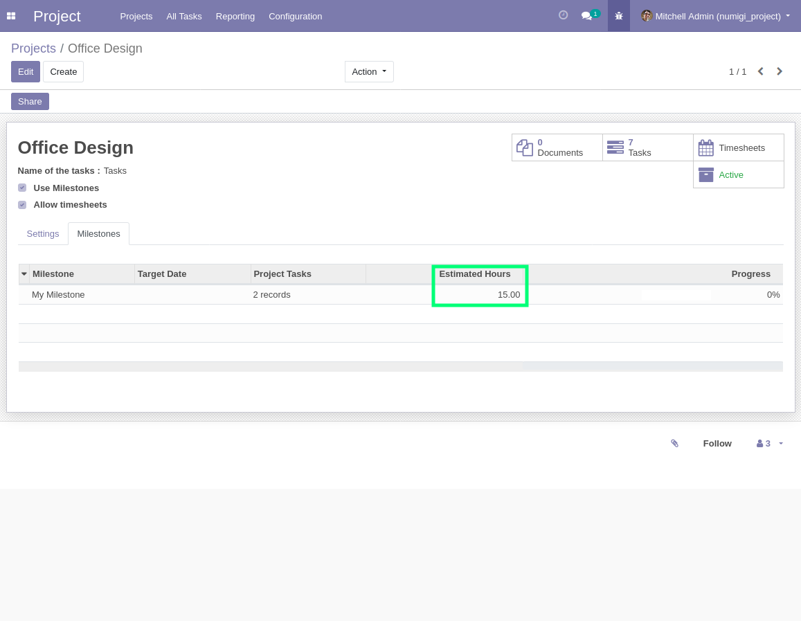

Project Milestone Estimated Hours
=================================

.. contents:: Table of Contents

Context
-------
The module `project_milestone <https://github.com/OCA/project/tree/14.0/project_milestone>`_ allows to define milestones for a project.

Multiple tasks in the project can be linked to a given milestone.

Description
-----------
Field estimated hours is displayed in form and list view of a project milestone and in tab of milestones of a project.
when a milestone is copied, value of estimated hours is copied too.

Overview
--------

I open the form of a project milestone and set value in field "Estimated hours.

I copy the milestone and value in field "Estimated hours is the same.

I open the list of milestones, the field is displayed.

I open the form of a project with notebook milestones, the field is displayed.

Contributors
------------
* Numigi (tm) and all its contributors (https://bit.ly/numigiens)
