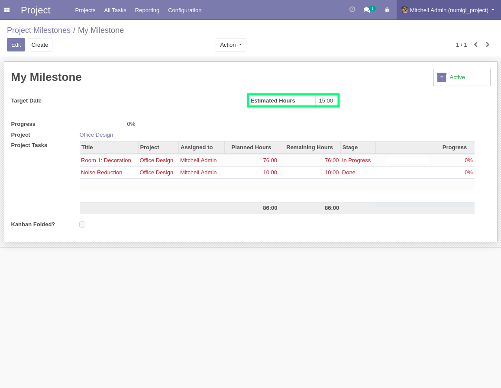
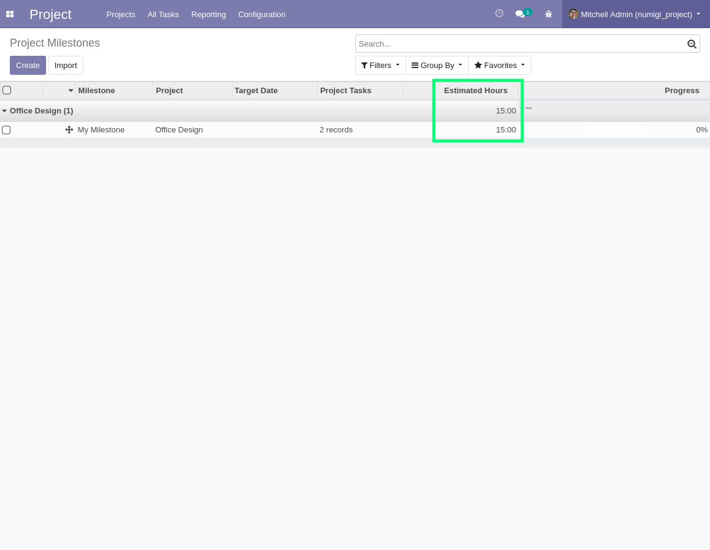
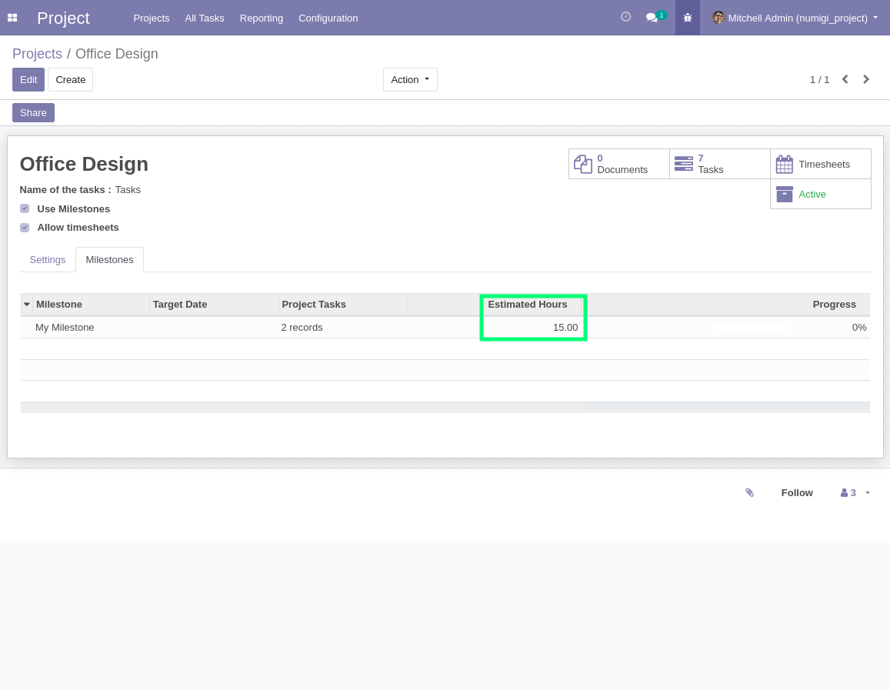

## Form View
As a **Project Manager**, I go to `Project > Configuration > All Milestones`.  

I open the **Milestone Form View** and set a value in the field `Estimated Hours`.

## List View

From the list view of **All Milestones**, I notice that the field `Estimated Hours` is displayed.

## Tab of a Project Form View
I open the form view of a **Project** and go to the tab **Milestones**.  I noticed that the field ` Estimated Hours` is displayed.

## Duplicate Milestone
I duplicate the **Milestone** and I notice that the value of the original field `Estimated Hours` is duplicated too.

