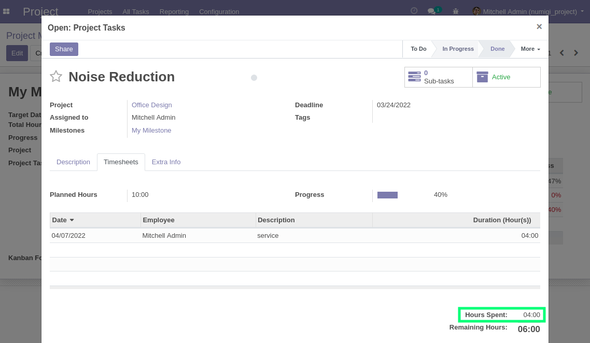
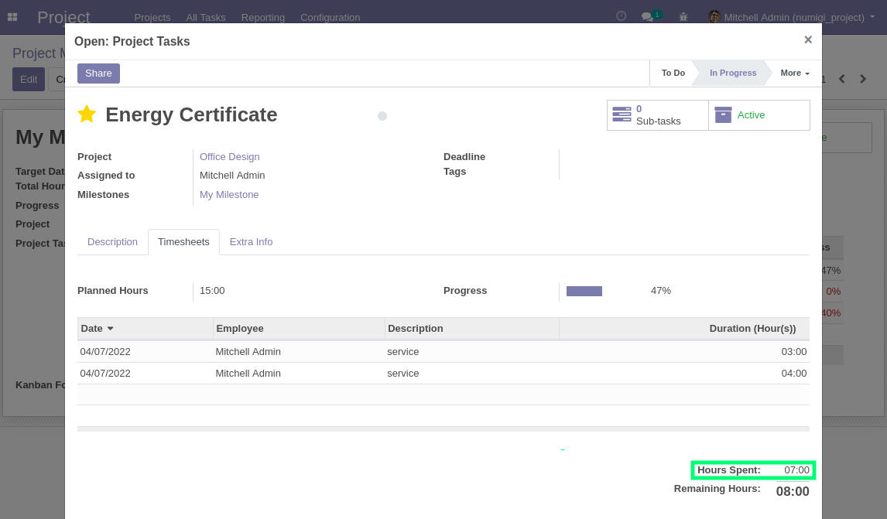
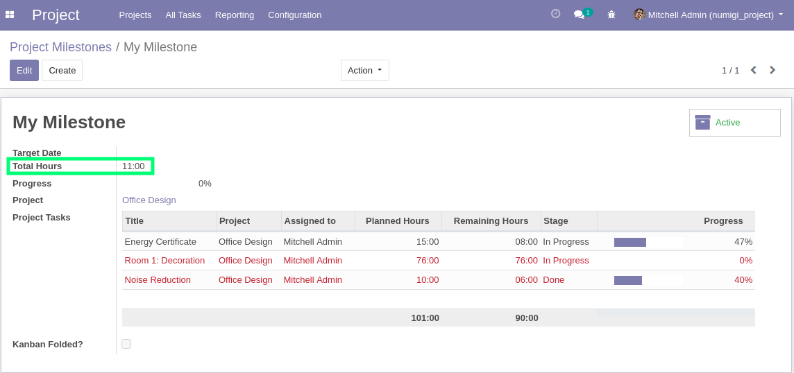

As a `Project/User`, I create timesheets and set `Duration` for 2 tasks associated to the same Milestone.

I open the Milestone, the field `Total Hours` is set with the **sum of timesheets spent hours** of associated tasks.

