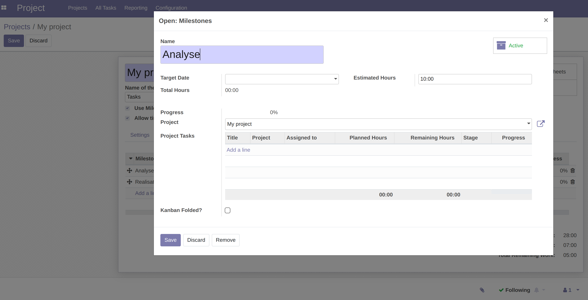
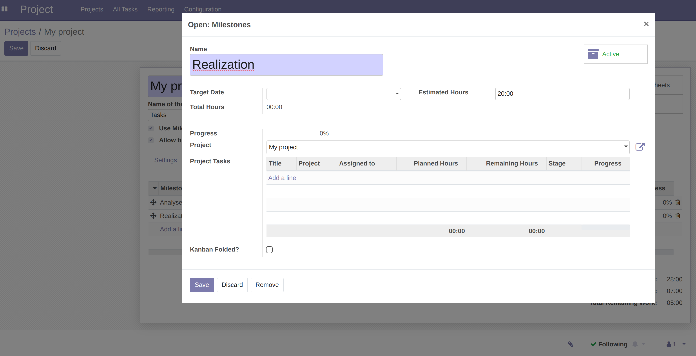
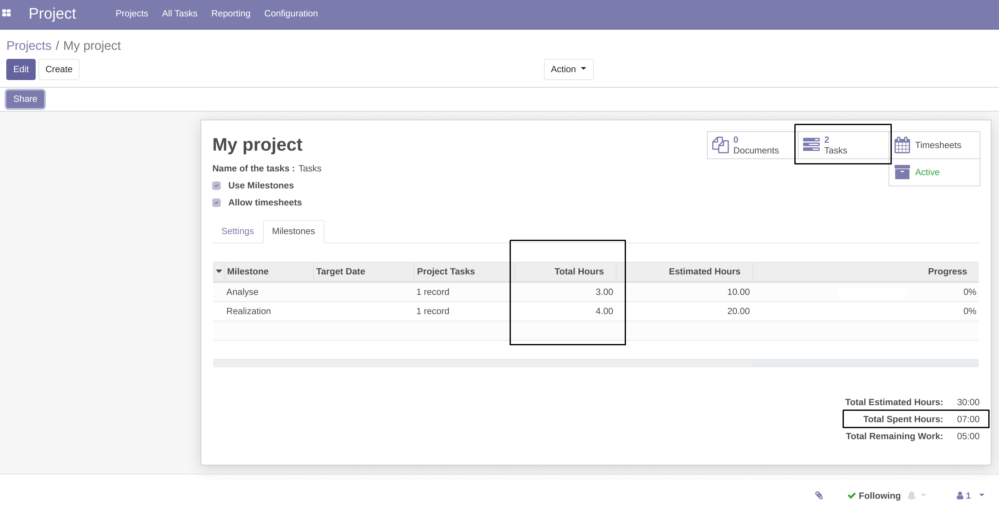

## Usage
As a user, from a project whose **Use milestones** box is checked, go to the tab of a project.

1. Add 2 milestones: 
* Analysis (estimated 10h)

* Realization (estimated 20h).

2. From the project tasks, assigned to the respective milestones, add timelines.

You can see that the estimated times of the milestones, and the times spent are well up in the list of milestones.

