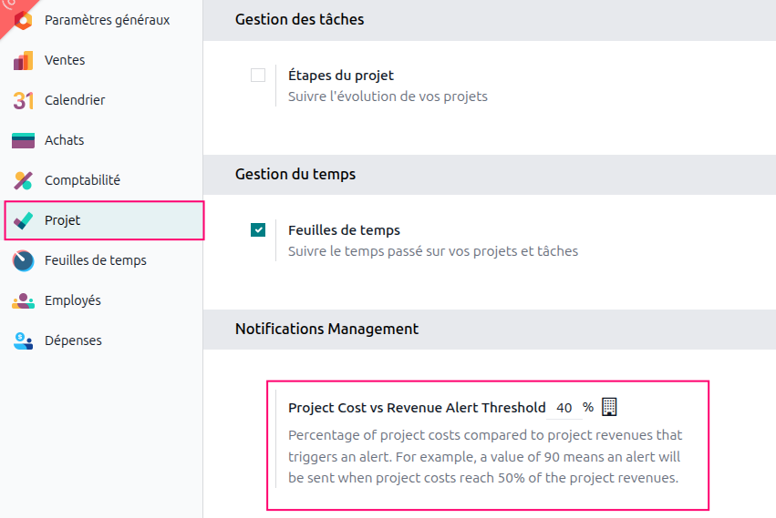
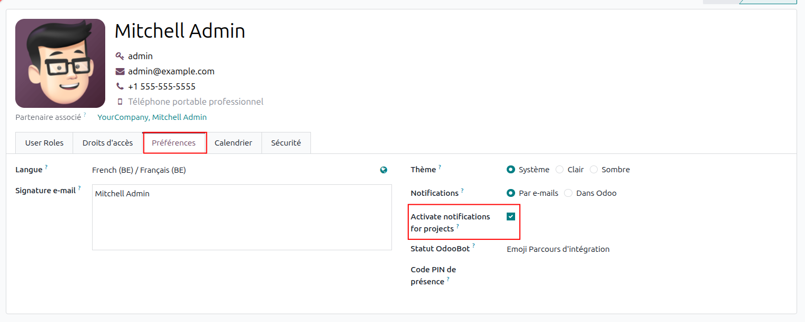
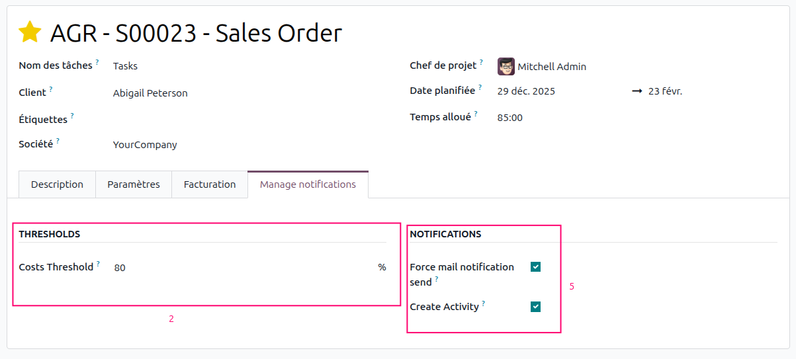

**1. Configure the default minimum margin threshold**
- Go to Settings > Project > Set the default threshold percentage

**2. Configure a project-specific minimum margin threshold (optional)**
- Go to Project > Open a project > Manage notifications section > Define a specific threshold for this project.

**3. Manage notification recipients**
- Define a Project Manager and followers (subscribers) for the project
These users will receive notifications when the threshold is reached.

**4. User notification preferences**
- Go to Settings > Open a user > Configure the user’s notification preferences.

**5. Project notification preferences**

When project costs exceed the configured percentage of revenues, the system automatically sends (via a cron)
- An email to manager and internal user followers if the Force Email Notification option is enabled from the project.
- An activity of type 'Minimum Margin Exceeded' for the project manager if the Create Activity option is enabled from the project.

