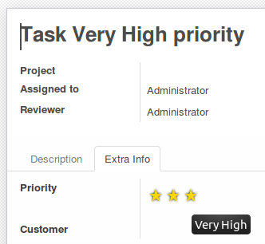
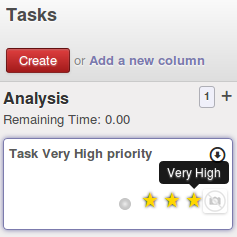
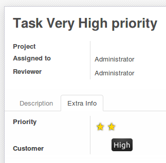
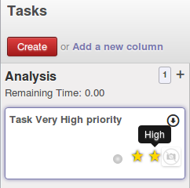

.. image:: https://img.shields.io/badge/license-AGPL--3-blue.png
   :target: https://www.gnu.org/licenses/agpl
   :alt: License: AGPL-3

==========================
Project Task Add Very High
==========================

This module extends the field `priority` in project tasks, adding two new levels of priority.
The two new levels of priority are: `High` and `Very High`.

On a task form, the priority widget is displayed with three stars instead of one:

On a Kanban view, the priority widget is displayed as well with three stars instead of one:

Without having this module installed, on the form it would look like as that:

and on Kanban:

In case this module is uninstalled, all the tasks that were previously set as `High` or `Very High` priority will be converted to `Normal` priority.

Usage
=====

To use this module, you need to:

#. Open a task or create a new one
#. On the priority widget, three stars are displayed (instead of one)
#. Click on the second star: the priority of this task is now set to `High`
#. Click on the third star: the priority of this task is now set to `Very High`

.. image:: https://odoo-community.org/website/image/ir.attachment/5784_f2813bd/datas
   :alt: Try me on Runbot
   :target: https://runbot.odoo-community.org/runbot/140/11.0

Bug Tracker
===========

Bugs are tracked on `GitHub Issues
<https://github.com/OCA/project/issues>`_. In case of trouble, please
check there if your issue has already been reported. If you spotted it first,
help us smash it by providing detailed and welcomed feedback.

Credits
=======

Images
------

* Odoo Community Association: `Icon <https://odoo-community.org/logo.png>`_.

Contributors
------------

* Andrea Stirpe <a.stirpe@onestein.nl>

Do not contact contributors directly about support or help with technical issues.

Maintainer
----------

.. image:: https://odoo-community.org/logo.png
   :alt: Odoo Community Association
   :target: https://odoo-community.org

This module is maintained by the OCA.

OCA, or the Odoo Community Association, is a nonprofit organization whose
mission is to support the collaborative development of Odoo features and
promote its widespread use.

To contribute to this module, please visit https://odoo-community.org.
