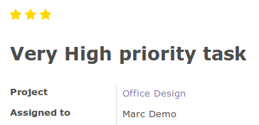
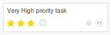
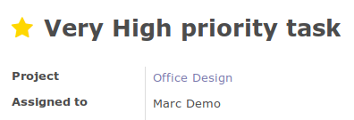
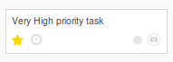

.. image:: https://img.shields.io/badge/licence-AGPL--3-blue.svg
   :target: http://www.gnu.org/licenses/agpl-3.0-standalone.html
   :alt: License: AGPL-3

==========================
Project Task Add Very High
==========================

This module extend the field `priority` in project tasks, adding a new level of priority.
This new level of priority is named `Very High`.

On a task form, the priority widget is shown as two stars instead of one:

Also on a kanban view, the priority widget is shown as two stars instead of one:

Without having this module installed, on the form it would look as that:

and on kanban:

In case this module is uninstalled, all the tasks that were previously set as `Very High` priority will be converted to `High` priority.

Usage
=====

To use this module, you need to:

#. Open a task or create a new one
#. On the priority widget, two stars are displayed (instead of one)
#. Click on the second star: the priority of this task is now set to `Very High`

.. image:: https://odoo-community.org/website/image/ir.attachment/5784_f2813bd/datas
   :alt: Try me on Runbot
   :target: https://runbot.odoo-community.org/runbot/140/10.0

Bug Tracker
===========

Bugs are tracked on `GitHub Issues
<https://github.com/OCA/project/issues>`_. In case of trouble, please
check there if your issue has already been reported. If you spotted it first,
help us smash it by providing detailed and welcomed feedback.

Credits
=======

Images
------

* Odoo Community Association: `Icon <https://github.com/OCA/maintainer-tools/blob/master/template/module/static/description/icon.svg>`_.

Contributors
------------

* Andrea Stirpe <a.stirpe@onestein.nl>

Maintainer
----------

.. image:: https://odoo-community.org/logo.png
   :alt: Odoo Community Association
   :target: https://odoo-community.org

This module is maintained by the OCA.

OCA, or the Odoo Community Association, is a nonprofit organization whose
mission is to support the collaborative development of Odoo features and
promote its widespread use.

To contribute to this module, please visit https://odoo-community.org.
