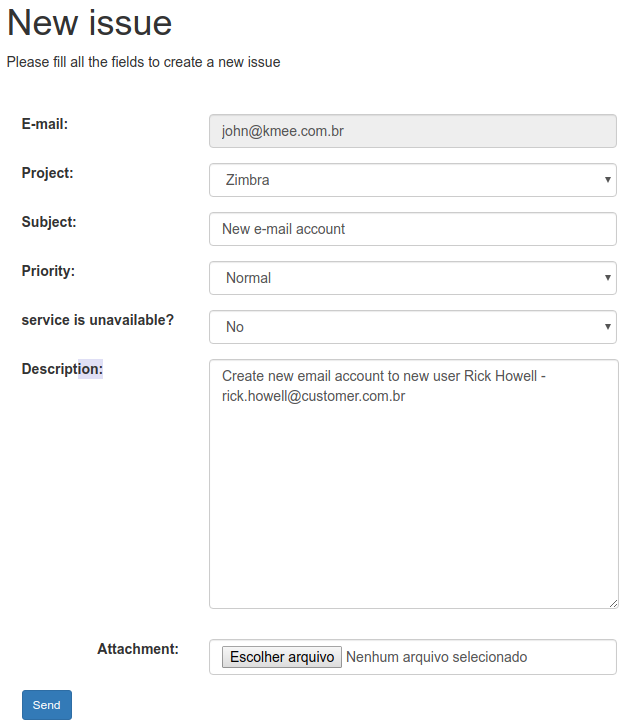
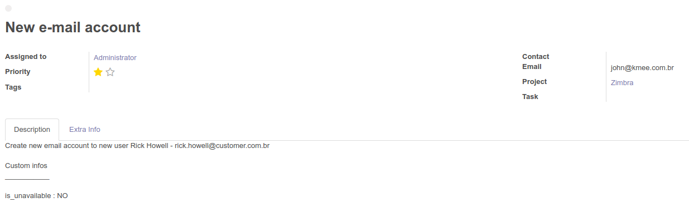
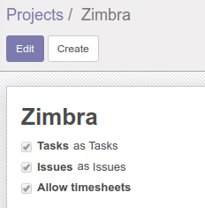

.. image:: https://img.shields.io/badge/licence-AGPL--3-blue.svg
   :target: http://www.gnu.org/licenses/agpl-3.0-standalone.html
   :alt: License: AGPL-3

====================
Website Portal Issue
====================

This module enable portal users and project followers to create project issue from website portal.

* Compatible with odoo community.
* If  portal user is a follower of more than one project, can choose the project they want to create new issue.
* An additional field "Service is unavailable" to increment description with information - Yes, No or Intermitent.

Create Issue
=============

Backend issue view
==================

Installation
============

To install this module, you just need click on install.

Configuration
=============

To configure this module, you need to:

#. Enable issue on Project Configuration

Bug Tracker
===========

Bugs are tracked on `GitHub Issues
<https://github.com/OCA/{project_repo}/issues>`_. In case of trouble, please
check there if your issue has already been reported. If you spotted it first,
help us smash it by providing detailed and welcomed feedback.

Credits
=======

Images
------

* Odoo Community Association: `Icon <https://github.com/OCA/maintainer-tools/blob/master/template/module/static/description/icon.svg>`_.

Contributors
------------
* Ananias Filho <ananias@kmee.com.br>
* Luis Felipe Miléo <mileo@kmee.com.br>

Funders
-------

The development of this module has been financially supported by:

* KMEE | kmee.com.br

Maintainer
----------

.. image:: https://odoo-community.org/logo.png
   :alt: Odoo Community Association
   :target: https://odoo-community.org

This module is maintained by the OCA.

OCA, or the Odoo Community Association, is a nonprofit organization whose
mission is to support the collaborative development of Odoo features and
promote its widespread use.

To contribute to this module, please visit https://odoo-community.org.
